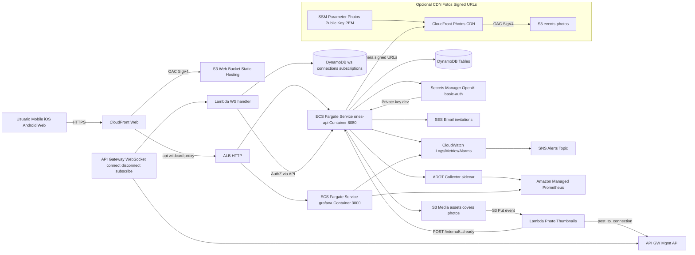
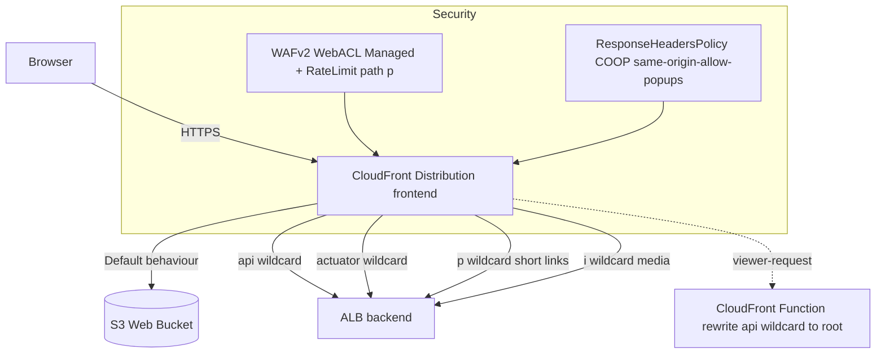
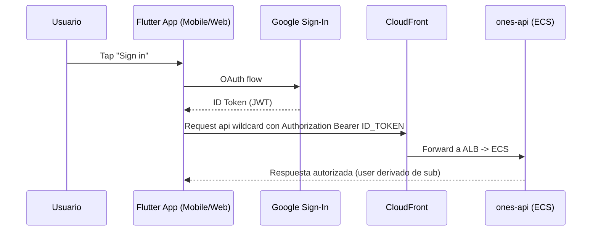
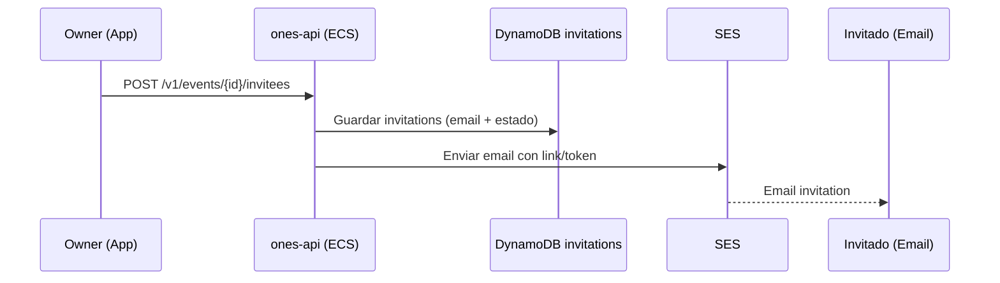
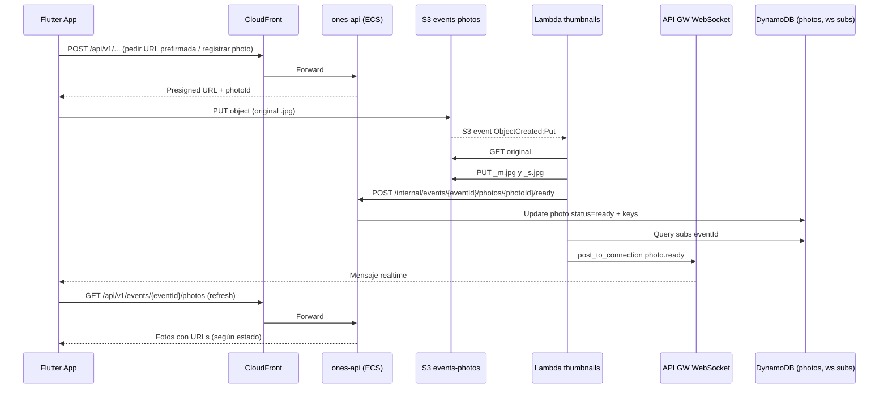
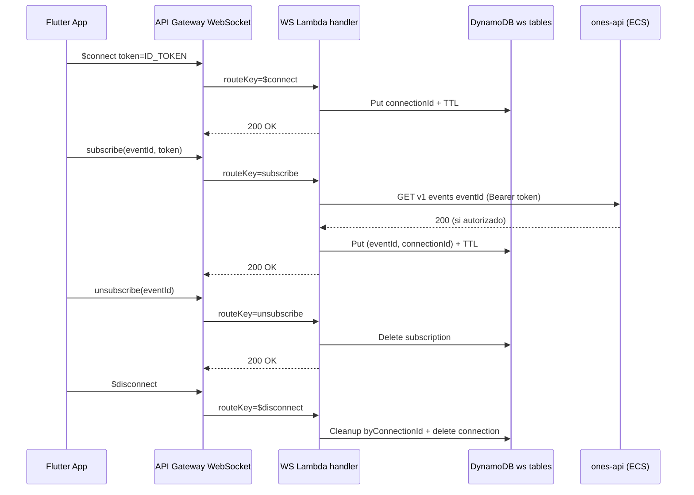

# Ones — Arquitectura (Front + Back + Infra AWS)

> Documento generado a partir de los templates CloudFormation bajo `infra/cloudformation/**`, más documentación interna del repo.
>
> Enfoque: describir **la arquitectura actualmente implementada** (as-is), sus componentes, sus responsabilidades, sus interacciones y los flujos de negocio principales.

---

## 0) Alcance y “fuentes de verdad”

### 0.1 Infra como código (IaC)

- **Backend (principal):** `infra/cloudformation/backend/all.yml` (stack principal, grande)
- **Backend (root nested):** `infra/cloudformation/backend/root.yml`
- **Backend (templates secundarios / legacy):**
  - `infra/cloudformation/backend.yml`
  - `infra/cloudformation/backend/backend.yml`
  - `infra/cloudformation/backend/cdn.yml`
- **Frontend (nested):**
  - `infra/cloudformation/frontend/root.yml`
  - `infra/cloudformation/frontend/s3.yml`
  - `infra/cloudformation/frontend/cloudfront.yml`
- **Frontend (legacy / simple):** `infra/cloudformation/web.yml`
- **Bootstrap CI/CD (OIDC GitHub Actions):** `infra/cloudformation/bootstrap-oidc.yml`

### 0.2 Código (implementación)

- **App Flutter:** `apps/ones_app/`
- **Backend Spring Boot:** `services/ones-api/`
- **Contrato OpenAPI:** `contracts/openapi.yaml`
- **Cliente API Flutter generado:** `packages/ones_api_client/`

### 0.3 Convenciones de naming y ambientes

En casi todos los recursos se usa el patrón:

- `StackPrefix` (default: `ones`)
- `Environment` (`dev | stage | prod`)

Ejemplos (con `StackPrefix=ones`, `Environment=dev`):

- `ones-dev-web-webbucket` (S3 web)
- `ones-dev-ones-api` (ECS service)
- `ones-dev-events` (DynamoDB)

---

## 1) Decisiones arquitecturales (resumen)

### 1.1 Monorepo + hexagonal (ports & adapters)

Basado en `docs/adr/0001-architecture.md`:

- Monorepo con:
  - `apps/` (front)
  - `services/` (back)
  - `contracts/` (OpenAPI)
  - `infra/` (CloudFormation + scripts)
- Arquitectura hexagonal tanto en front como en back para separar:
  - **dominio / casos de uso**
  - **adaptadores** (REST, DynamoDB, S3, etc.)

### 1.2 AWS administrado, con foco en escalabilidad horizontal

- **Frontend Web:** S3 + CloudFront
- **Backend:** ECS Fargate + ALB
- **Persistencia:** DynamoDB (principal) + S3 (media)
- **Tiempo real:** API Gateway WebSocket + DynamoDB (subscriptions)
- **Observabilidad:** CloudWatch Logs/Alarms + Amazon Managed Prometheus (AMP) + Grafana en ECS

**Racional de escalabilidad:**

- Componentes como CloudFront, S3, DynamoDB y API Gateway WebSocket escalan administradamente.
- El backend es **stateless** y puede escalar con ECS (`BackendDesiredCount`), evitando puntos únicos de fallo a nivel de aplicación.

### 1.3 Autenticación: Google ID Token (sin Cognito en MVP)

- El cliente obtiene un **Google ID Token**.
- El backend lo valida como **JWT**.
- El `userId` se deriva típicamente del claim `sub`.

---

## 2) Diagrama general de arquitectura (alto nivel)

---

## 3) Catálogo de servicios (qué existe y para qué sirve)

### 3.1 Frontend Web

#### 3.1.1 S3 Web Bucket
- **Template:** `infra/cloudformation/frontend/s3.yml`
- **Recurso:** `AWS::S3::Bucket` (`ones-<env>-web-webbucket`)
- **Objetivo:** almacenar el build estático de Flutter Web.
- **Seguridad:** bloquea acceso público; sólo CloudFront puede leer (OAC).

#### 3.1.2 CloudFront (Web)
- **Template:** `infra/cloudformation/frontend/cloudfront.yml`
- **Objetivo:**
  - Servir estáticos desde S3.
  - Proxyear `/api/*` hacia el ALB del backend.
  - Manejar SPA routing (404/403 => `index.html`).

**Comportamientos clave:**
- **Default behavior:** S3 (`index.html`, assets)
- **`api/*`:** ALB (no cache; forward headers `Authorization`, `Content-Type`, `Origin`)
- **`actuator/*`:** ALB (sin cache; útil para métricas/actuator)
- **`p/*` y `i/*`:** ALB (paths de short links / imágenes)

**CloudFront Function:**
- Reescribe `request.uri` de `/api/*` a `/*` para el origin ALB.

**Headers Policy:**
- Agrega `Cross-Origin-Opener-Policy: same-origin-allow-popups`.
- Objetivo: compatibilidad con Google Sign-In en web (evitar bloqueo de popups).

#### 3.1.3 WAF (Web ACL)
- **Template:** `infra/cloudformation/frontend/cloudfront.yml`
- **Objetivo:**
  - Reglas administradas (`AWSManagedRulesCommonRuleSet`).
  - Rate limit específico para rutas `/p/` (short links).

---

### 3.2 Backend (runtime)

#### 3.2.1 ALB (Application Load Balancer)
- **Template:** `infra/cloudformation/backend/all.yml`
- **Objetivo:**
  - Ingreso HTTP al cluster ECS.
  - Ruteo a:
    - `ones-api` (puerto `8080`)
    - `grafana` (puerto `3000`, por path `/grafana/*`).

#### 3.2.2 ECS Cluster + Services
- **Template:** `infra/cloudformation/backend/all.yml`
- **Servicios ECS:**
  - `ones-api` (Spring Boot, `:8080`)
  - `grafana` (`:3000`)

**Escalabilidad:**
- `BackendDesiredCount` controla cantidad de tareas de `ones-api`.
- El diseño es **horizontalmente escalable** (stateless + DynamoDB/S3), aunque el valor real depende de configuración por ambiente.

#### 3.2.3 ECR Repositories
- **Template:** `infra/cloudformation/backend/all.yml`
- **Repos:**
  - `ones-<env>-ones-api`
  - `ones-<env>-photo-thumbnails`

Objetivo:
- Hospedar imágenes Docker para ECS y (opcionalmente) Lambda image-based.

---

### 3.3 Persistencia (DynamoDB)

> **Template:** `infra/cloudformation/backend/all.yml`

#### 3.3.1 Tablas principales

- **`events`** (`ones-<env>-events`)
  - PK: `eventId`
  - GSI: `gsi1` (`gsi1pk`, `gsi1sk`)

- **`users`** (`ones-<env>-users`)
  - PK: `userId`
  - GSI: `byEmail` (`email`)

- **`invitations`** (`ones-<env>-invitations`)
  - PK: `inviteeEmail`, SK: `eventId`
  - GSI: `byEventId`

- **`photos`** (`ones-<env>-photos`)
  - PK: `photoId`
  - GSI: `byEventId` (`eventId`, `eventSortKey`)

- **`photo-likes`** (`ones-<env>-photo-likes`)
  - PK: `photoId`, SK: `userId`
  - GSI: `gsi1`

- **`photo-shortlinks`** (`ones-<env>-photo-shortlinks`)
  - PK: `code`
  - TTL: `expiresAt`

- **`preferred-names-cache`** (`ones-<env>-preferred-names-cache`)
  - PK: `userId`
  - TTL: `expiresAt`

- **`admins`** (`ones-<env>-admins`)
  - PK: `email`

- **`frames`** (`ones-<env>-frames`)
  - PK: `frameId`
  - GSI: `gsi1`

- **`event-templates`** (`ones-<env>-event-templates`)
  - PK: `eventTemplateId`
  - GSI: `gsi1`

- **`translations`** (`ones-<env>-translations`)
  - PK: `translationKey`, SK: `languageCode`
  - GSI: `LanguageCodeIndex` (`languageCode`, `translationKey`)
  - Nota: esta tabla está en **PROVISIONED** y tiene autoscaling para tabla e índice.

#### 3.3.2 WebSocket state (tiempo real)

- **`photos-ws-connections`** (`ones-<env>-photos-ws-connections`)
  - PK: `connectionId`
  - TTL: `expiresAt`

- **`photos-ws-subscriptions`** (`ones-<env>-photos-ws-subscriptions`)
  - PK: `eventId`, SK: `connectionId`
  - GSI: `byConnectionId` (`connectionId`, `eventId`)
  - TTL: `expiresAt`

---

### 3.4 Almacenamiento de media (S3)

> **Template:** `infra/cloudformation/backend/all.yml`

- **`events-covers-tmp`** (`ones-<env>-events-covers-tmp`)
  - Objetivo: previews temporales (p. ej. covers generados)
  - Lifecycle: expira objetos a 1 día

- **`events-assets`** (`ones-<env>-events-assets`)
  - Objetivo: assets del evento

- **`events-photos`** (`ones-<env>-events-photos`)
  - Objetivo: fotos originales y thumbnails
  - Notificación S3 -> Lambda (thumbnail generation)

---

### 3.5 Procesamiento asíncrono (Lambdas)

#### 3.5.1 Cleanup Lambda (Custom Resource)
- **Template:** `infra/cloudformation/backend/all.yml`
- **Código fuente:** `infra/lambda/cleanup/index.py`
- **Objetivo:**
  - Vaciar buckets S3 y borrar imágenes ECR cuando se elimina el stack (evitar recursos huérfanos).

#### 3.5.2 Photo Thumbnails Lambda
- **Template:** `infra/cloudformation/backend/all.yml`
- **Modos:**
  - **ZIP Lambda** (con layer Pillow)
  - **Image Lambda** (con ECR `photo-thumbnails:latest`)

- **Código:**
  - ZIP: `infra/lambda/photo-thumbnails-zip/index.py`
  - Image: `infra/photo-thumbnails-lambda/app.py`

- **Trigger:** `s3:ObjectCreated:Put` en `events-photos`.

- **Responsabilidad funcional:**
  - Generar thumbnails `_m` y `_s`.
  - Llamar al backend `POST /internal/events/{eventId}/photos/{photoId}/ready`.
  - Publicar evento `photo.ready` por WebSocket a suscriptores.

---

### 3.6 Tiempo real (API Gateway WebSocket)

- **Template:** `infra/cloudformation/backend/all.yml`
- **API:** `AWS::ApiGatewayV2::Api` (WEBSOCKET)
- **Routes:**
  - `$connect`
  - `$disconnect`
  - `subscribe`
  - `unsubscribe`
  - `$default`

- **Handler:** `PhotosWebSocketHandlerFunction` (Lambda)

**Decisión clave para escalabilidad:**
- En `$connect` sólo se exige presencia de `token`.
- La autorización fuerte se hace en `subscribe`:
  - llama al backend (`GET /v1/events/{eventId}`) con `Bearer token`.
  - sólo si el backend autoriza, se guarda la suscripción.

Esto evita llamadas externas “en caliente” (p. ej. a Google `tokeninfo`) y soporta mejor miles de conexiones.

---

### 3.7 CDN de fotos (opcional, Signed URLs)

> **Template:** `infra/cloudformation/backend/all.yml` (condición `EnablePhotosCdnCond`)

Componentes:
- CloudFront Distribution (Photos)
- Origin Access Control (OAC) hacia S3 `events-photos`
- PublicKey + KeyGroup para **TrustedKeyGroups**
- CORS ResponseHeadersPolicy para permitir origen web

Material criptográfico:
- **Public key:** en SSM Parameter (`CdnPhotosSigningPublicKeySsmParamName`)
- **Private key:** en Secrets Manager (`CloudFrontPrivateKeySecret`, sólo `IsNotProdEnv` en el template)

**Objetivo:**
- Servir fotos vía CloudFront con control de acceso mediante URLs firmadas.

---

### 3.8 Email (SES)

- **Template:** `infra/cloudformation/backend/all.yml`
- Recurso: `AWS::SES::EmailIdentity` (condición `IsNotProdEnv`)
- Objetivo:
  - Permitir envío de invitaciones / notificaciones por email.

---

### 3.9 Observabilidad y alertas

#### 3.9.1 Logs y métricas
- **CloudWatch LogGroup:** `/${StackPrefix}/${Environment}/ones-api`
- **MetricFilter:** detecta frase `"Falling back to DynamoDB Scan"` y emite métrica custom `dynamodb_scan_fallback`.

#### 3.9.2 Alarmas
- Alarmas de throttling para tablas e índices relevantes.
- Alarmas de `dynamodb_scan_fallback`.

#### 3.9.3 SNS Alerts Topic
- Topic: `${StackPrefix}-${Environment}-alerts`
- Objetivo: canalizar alarmas.

#### 3.9.4 AMP + ADOT + Grafana
- **AMP Workspace:** `AWS::APS::Workspace`
- **ADOT Collector (sidecar):** scrapea `/actuator/prometheus` con BasicAuth y hace `remote_write` a AMP.
- **Grafana:** servicio ECS con provision de datasources (AMP SigV4 + CloudWatch).

---

### 3.10 CI/CD y permisos (GitHub Actions OIDC)

- **Template:** `infra/cloudformation/bootstrap-oidc.yml`
- **Objetivo:**
  - Permitir que GitHub Actions asuma un role AWS vía OIDC (`sts:AssumeRoleWithWebIdentity`) sin llaves estáticas.
  - Con permisos para desplegar CloudFormation y administrar recursos necesarios (S3, CloudFront, WAF, ECS, DynamoDB, Logs, CloudWatch alarms, SNS, SES, AMP, Lambda, etc.).

---

## 4) Diagrama detallado — Frontend Web (CloudFront behaviours)

---

## 5) Diagrama detallado — Backend runtime (red + cómputo)

```mermaid
flowchart LR
  subgraph AWS[AWS Region]
    subgraph VPC[VPC 10.0.0.0-16]
      subgraph PublicA[Public Subnet A]
        ALB
        ECS_TASK_A[ECS Task ones-api + adot]
        GRAF_TASK_A[ECS Task grafana]
      end
      subgraph PublicB[Public Subnet B]
        ECS_TASK_B[ECS Task ones-api + adot]
        GRAF_TASK_B[ECS Task grafana]
      end

      ALB -->|TargetGroup :8080| ECS_TASK_A
      ALB -->|TargetGroup :8080| ECS_TASK_B
      ALB -->|TargetGroup :3000 rule grafana wildcard| GRAF_TASK_A
      ALB -->|TargetGroup :3000 rule grafana wildcard| GRAF_TASK_B
    end

    DDB[(DynamoDB)]
    S3[(S3 Buckets)]
    SM[(Secrets Manager)]
    SES[(SES)]
    CW[(CloudWatch)]
    AMP[(Amazon Managed Prometheus)]

    ECS_TASK_A --> DDB
    ECS_TASK_A --> S3
    ECS_TASK_A --> SM
    ECS_TASK_A --> SES
    ECS_TASK_A --> CW

    ECS_TASK_A --> ADOT_A[ADOT Collector] --> AMP
    GRAF_TASK_A --> AMP
    GRAF_TASK_A --> CW
  end
```

---

## 6) Seguridad (visión completa)

### 6.1 Entrada pública
- **Web:** CloudFront con TLS.
- **API:** por CloudFront (`/api/*`) hacia ALB (origin `http-only`).

### 6.2 Autenticación y autorización
- **Auth principal:** Bearer token = Google ID Token.
- **Autorización de dominio:** se valida en backend (owner/invitation accepted, etc.).

### 6.3 Seguridad en WebSocket
- `$connect`: requiere `token` presente.
- `subscribe`: requiere `{eventId, token}` y valida acceso con backend.
- Esto evita que conexiones sin permisos reciban eventos.

### 6.4 Acceso a media
- **S3** con CORS amplio (`*`).
- **CDN fotos (opcional):** CloudFront + OAC + Signed URLs (TrustedKeyGroups).

### 6.5 Secrets
Secrets relevantes (ejemplos):
- OpenAI API key (`ones-<env>-openai-api-key`)
- BasicAuth actuator (`ones-<env>-actuator-basic-auth`)
- BasicAuth internal (`ones-<env>-internal-basic-auth`)
- Grafana admin (`ones-<env>-grafana-admin`)
- Invitation HMAC (`ones-<env>-invitation-email-action-token`)
- CloudFront private key (dev) (`ones-<env>-cloudfront-private-key`)

---

## 7) Observabilidad y SLOs operacionales

### 7.1 Métricas de plataforma
- DynamoDB throttles (Read/WriteThrottleEvents) por tabla e índices.
- Alarmas hacia SNS `alerts`.

### 7.2 Métricas de “salud lógica”
- `dynamodb_scan_fallback` (MetricFilter sobre logs).
- Objetivo: detectar regresiones de queries / índices.

### 7.3 Métricas de aplicación
- Spring Boot expone `/actuator/prometheus`.
- Scrape local por sidecar ADOT y envío a AMP.

### 7.4 Dashboards
- Grafana se provisiona con datasources:
  - AMP (Prometheus)
  - CloudWatch
- Incluye dashboards relacionados a DynamoDB throttling, cache hit ratio, y scan fallback.

---

## 8) Inventario de CloudFormation (qué stack crea qué)

### 8.1 Frontend stack (nested)
- **Root:** `infra/cloudformation/frontend/root.yml`
  - Nested S3: `frontend/s3.yml`
  - Nested CloudFront: `frontend/cloudfront.yml`

### 8.2 Backend stack (nested)
- **Root:** `infra/cloudformation/backend/root.yml`
  - Nested all-in-one: `backend/all.yml`

### 8.3 Bootstrap OIDC (CI/CD)
- `infra/cloudformation/bootstrap-oidc.yml`

### 8.4 Templates secundarios / legacy
Se mantienen en el repo pero **no son el “main path” recomendado**:
- `infra/cloudformation/backend.yml`
- `infra/cloudformation/backend/backend.yml`
- `infra/cloudformation/backend/cdn.yml`
- `infra/cloudformation/web.yml`

---

## 9) Flujos de negocio (cómo interactúan los servicios)

> Esta sección describe la ejecución real de casos de uso end-to-end.

### 9.1 Login (Mobile/Web)

### 9.2 Listado y detalle de eventos (seguridad de acceso)
- **Cliente** llama `GET /v1/events` y `GET /v1/events/{id}`.
- **Backend** valida que el usuario sea:
  - owner del evento, o
  - invitado con invitación aceptada.
- **Persistencia:** DynamoDB (`events`, `invitations`, `users`).

### 9.3 Invitaciones por email

### 9.4 Subida de foto (upload + procesamiento + tiempo real)

### 9.5 WebSocket subscribe / unsubscribe (control de acceso)

### 9.6 Visualización de fotos (directo S3 vs CDN)

- **Sin CDN fotos:** backend entrega URLs prefirmadas de S3, el cliente descarga directo.
- **Con CDN fotos:** backend entrega URLs firmadas de CloudFront.

**Componentes involucrados (con CDN):**
- `PhotosDistribution` (CloudFront)
- `PhotosCdnPublicKey` + `PhotosCdnKeyGroup`
- `CloudFrontPrivateKeySecret` (dev) para firmar
- `SSM Parameter` para public key (verificación)

### 9.7 i18n (traducciones)

- El backend mantiene traducciones en `ones-<env>-translations`.
- El cliente cachea traducciones localmente y refresca desde API.
- Hay endpoints admin para seed/refresh/evict de cache (ver controllers admin).

### 9.8 Observabilidad y respuesta ante incidentes (ejemplo)

- Si el backend cae en "Falling back to DynamoDB Scan":
  - CloudWatch MetricFilter incrementa `dynamodb_scan_fallback`.
  - CloudWatch Alarm se dispara.
  - SNS AlertsTopic recibe la alerta.
- Grafana permite correlacionar:
  - throttles DynamoDB
  - hit ratio de caches
  - scan fallback

---

## 10) Notas de escalabilidad y disponibilidad (as-is vs futuro)

### 10.1 Lo que ya escala bien (servicios administrados)
- CloudFront
- S3
- DynamoDB
- API Gateway WebSocket
- AMP

### 10.2 Lo que depende de configuración
- ECS `BackendDesiredCount` (1 vs N)
- No hay autoscaling ECS definido aquí (puede agregarse con target tracking CPU/ALB RPS).

### 10.3 Riesgos / tradeoffs actuales documentados
- VPC con subnets públicas y `AssignPublicIp: ENABLED` (MVP). En producción suele migrarse a subnets privadas + NAT.
- CORS amplio (`*`) en buckets (MVP).

---

## 11) Referencias internas

- ADR: `docs/adr/0001-architecture.md`
- WebSocket + i18n + gallery: `docs/photos-ws-i18n-gallery.md`
- Infra observability: `infra/README.md`
- Guía para nuevas tablas DynamoDB: `infra/cloudformation/ADDING_DYNAMODB_TABLES.md`
